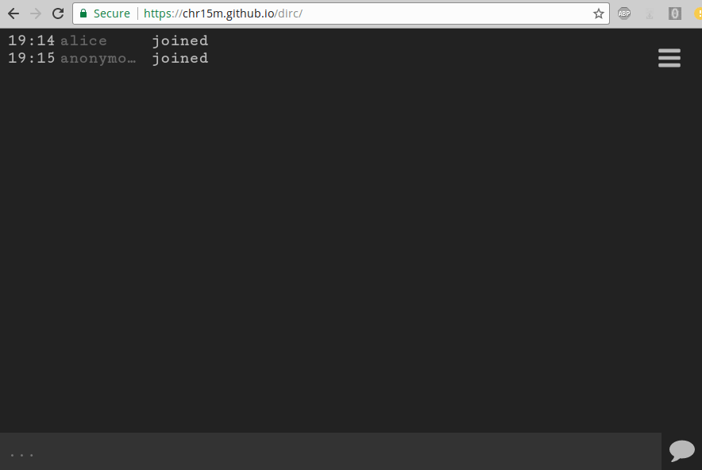

p2p IRC-inspired self-hosted web chat. **[Try it](https://chr15m.github.io/dirc#hello)**.



 * Identities are key pairs (NaCl).
 * Messaging over WebRTC using [Bugout](https://github.com/chr15m/bugout).
 * Trust minimised architecture.

Built on [WebTorrent](https://webtorrent.io/).

### Self-hosted install

Since dirc is an entirely client-side web app with no server component, self-hosting just means hosting the static html, js, and css.

 1. [Download a release](https://github.com/chr15m/dirc/releases/latest).
 2. Upload it to your static web host.

The web app runs in the browser and independent instances speak to eachother using WebRTC. Regardless of where the static app files are hosted, all instances on all domains can reach each other and join the same chat room. The main reasons to self-host are:

 * You can be sure of the integrity of the client code: nobody can tamper with the app code if the files are stored on your own server.
 * Because of the way the web works, whoever owns the domain the app is served from can read your client side keys. Self-hosting eliminates this possibility.

### Configure STUN/TURN servers

For better performance behind restrictive firewalls you may wish to specify your own STUN/TURN webRTC servers. You can do that in the console as follows:

```
	localStorage["dirc-wt-config"] = JSON.stringify({rtcConfig: {tracker: {iceServers: [{urls: 'YOUR-SERVER' }, {url: 'YOUR-OTHER-SERVER'}, ...] }}});
```

### Limitations

 * WebTorrent peer discovery uses wss trackers - which are essentially a centralized service.
 * No security audit has been done on this codebase.
 * Web browsers are notoriously leaky.
 * WebRTC has been known to leak around Tor.
 * Eavesdropping on a channel without revealing the listener is easy.

In short, this is an experiment, please don't rely on it for high security communication.

Patches welcome!
